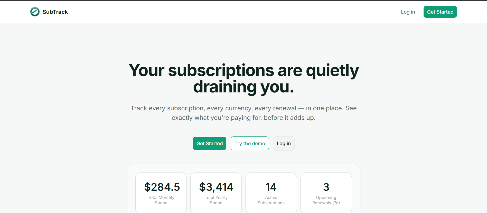
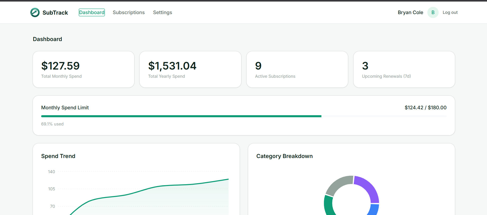
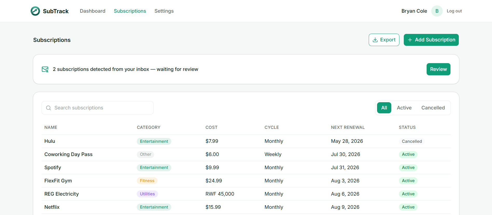
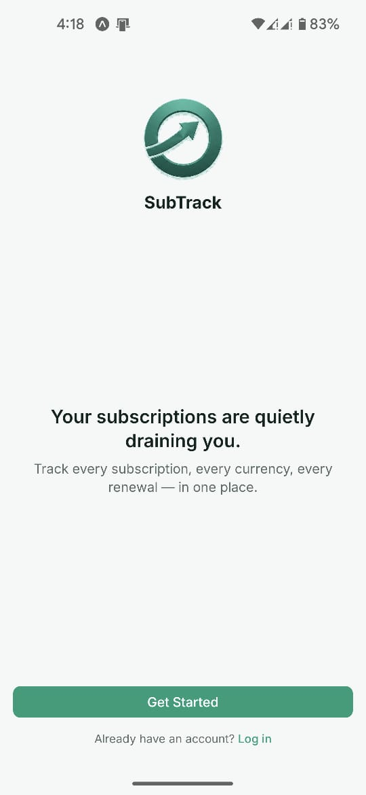
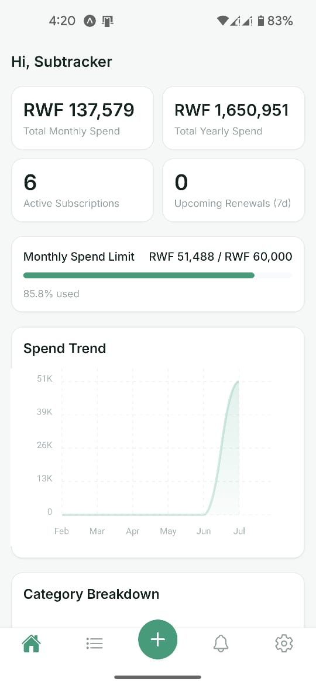
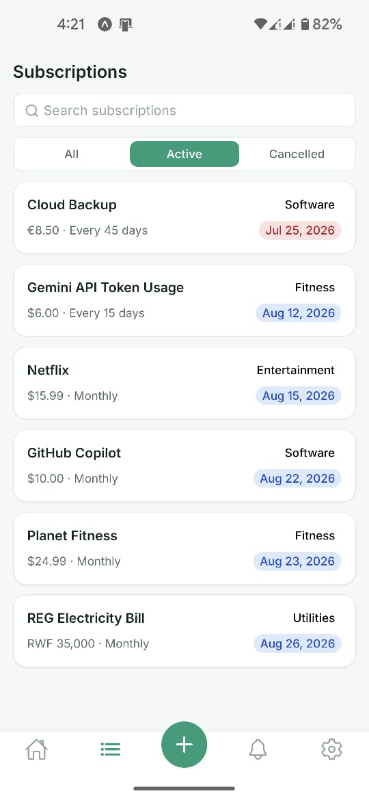

<div align="center">

# 📊 SubTrack

**Never get blindsided by a renewal again.**

A full-stack subscription and recurring-expense tracker — log what you pay for once, and let SubTrack calculate renewals, track payment history, convert currencies, catch subscriptions from your inbox, and show you exactly where your money goes.

[](https://nextjs.org/)
[](https://nestjs.com/)
[](https://expo.dev/)
[](https://www.typescriptlang.org/)
[](https://www.postgresql.org/)
[](https://tailwindcss.com/)

**[🔴 Live App](https://subtrack-web-two.vercel.app/) · [📑 Live API Docs](https://subtrack-api-djbr.onrender.com/api/docs)**

</div>

---

## 🔴 Try It Now

**[subtrack-web-two.vercel.app](https://subtrack-web-two.vercel.app/)** — click **Try the demo** on the landing page for an instant tour, no registration needed. The demo account is reseeded every night with fresh, relative dates (mixed currencies, months of payment history, a partially-used spend limit, a couple of pending Gmail-detected subscriptions) so it always looks lived-in.

> The API (`subtrack-api-djbr.onrender.com`) runs on Render's free tier, which sleeps after 15 minutes idle — the first request can take 30–60s to wake it back up. Everything after that is normal speed. See Phase 14 in [`context/build-plan.md`](context/build-plan.md) for how renewal correctness is kept independent of that sleep cycle.

---

## 🧐 The Problem

Subscriptions are invisible once set up. They renew silently, spend creeps up month over month, and there's no single place to see what you're actually paying for — especially when your subscriptions are billed in different currencies (a Netflix sub in USD, a local gym membership in RWF).

**SubTrack gives you one source of truth:** what you're subscribed to, what it costs in one currency, when it renews next, and how your spend is trending.

---

## 📸 Screenshots

<table>
<tr>
<td align="center"><b>Landing</b></td>
<td align="center"><b>Dashboard</b></td>
<td align="center"><b>Subscriptions</b></td>
</tr>
<tr>
<td></td>
<td></td>
<td></td>
</tr>
</table>

<table>
<tr>
<td align="center"><b>Mobile Welcome</b></td>
<td align="center"><b>Mobile Dashboard</b></td>
<td align="center"><b>Mobile Subscriptions</b></td>
</tr>
<tr>
<td></td>
<td></td>
<td></td>
</tr>
</table>

---

## ✨ Features

- 🔐 **Email/password auth** — self-rolled JWT (access + refresh tokens)
- 💳 **Subscription CRUD** — name, cost, currency, billing cycle (weekly / monthly / yearly / custom), category, start date
- 🔁 **Catch-up-safe renewal tracking** — a daily scheduled job advances due renewals and logs payment history; if a run is missed (e.g. the host was asleep), it backfills every missed cycle correctly dated instead of losing history
- 💱 **Multi-currency support** — every subscription keeps its original currency; dashboard totals convert to your base currency using cached exchange rates
- 📈 **Dashboard** — total monthly/yearly spend, category breakdown, 6-month spend trend, upcoming renewals
- 🔎 **Subscriptions list** — filter by active/cancelled, search by name
- 🎯 **Monthly spend limits** — progress bar under the dashboard stats (accent → warning → over-limit), settable in Settings
- 🔔 **Push notifications** (Expo) — renewal reminders and spend-limit alerts, with a dedicated Alerts tab on mobile
- 📧 **Gmail auto-detection** — connects read-only to Gmail, scans for subscription receipt emails, and surfaces detected subscriptions for one-tap approve/dismiss (never auto-creates)
- 📤 **CSV/PDF export** — subscriptions and payment history, one click
- 📱 **Mobile companion app** — full CRUD, dashboard, alerts, and settings on Expo, talking to the same API as web, with its own branded icon/splash and welcome screen
- 🧪 **Seeded demo account** — nightly-reset, so any reviewer can explore real add/edit/cancel flows against realistic data
- 🩺 **Reliable scheduling on a free host** — GitHub Actions wakes and triggers all four scheduled jobs daily via authenticated endpoints, independent of whether Render's in-process cron happened to be asleep

---

## 🧱 Tech Stack

| Layer | Technology | Role |
|---|---|---|
| 🌐 **Web** | Next.js 16 (App Router) | Frontend only — no business logic |
| 🚀 **API** | NestJS | Owns all business logic, auth, DB access, scheduled jobs |
| 📱 **Mobile** | Expo (React Native) + Expo Router | Consumes the same API as web |
| 🗄️ **Database** | PostgreSQL (Neon) | Single source of truth |
| 🧬 **ORM** | TypeORM | Entities, versioned migrations, repositories |
| 🔑 **Auth** | Nest Passport + JWT | Self-rolled, access + refresh tokens |
| ⏰ **Scheduling** | `@nestjs/schedule` + GitHub Actions | In-process cron backed by an external daily trigger, so jobs run even through host sleep |
| 💱 **Currency data** | open.er-api.com | Free, keyless FX rates, cached in DB |
| 📧 **Email integration** | Gmail API (OAuth2, readonly) | Detects subscription receipts, never reads or sends other mail |
| 🔔 **Push notifications** | `expo-notifications` + `expo-server-sdk` | Renewal reminders and spend-limit alerts |
| 📤 **Export** | `pdfkit` + manual CSV serialization | Subscriptions and payment history downloads |
| 📊 **Charts** | Recharts (web) / `react-native-chart-kit` (mobile) | Dashboard visualizations |
| 🎨 **Styling** | Tailwind CSS v4 + shadcn/ui (web) · NativeWind (mobile) | Shared design tokens across platforms |
| 📑 **API docs** | Swagger / OpenAPI, live in production | Auto-generated from every controller and DTO |
| 🛡️ **Language** | TypeScript (strict) | Across all three apps |
| ☁️ **Hosting** | Vercel (web) · Render (API) · Neon (Postgres) | See [Hosting](context/code-standards.md#hosting) for why |

---

## 📁 Project Structure

This is an npm-workspaces monorepo with three independent apps sharing one API contract:

```
subtrack/
├── AGENTS.md              → Entry point for any AI agent working on this repo
├── context/                → Living documentation — architecture, API contract, build plan, UI system
│   └── screenshots/         → Reviewer-facing screenshots referenced by this README
├── .github/workflows/       → scheduled-jobs.yml — daily external trigger for renewals/notifications/email-scan/exchange-rates
├── render.yaml              → Render Blueprint for apps/api
├── apps/
│   ├── web/                → Next.js — UI + API calls only, zero business logic
│   ├── api/                → NestJS — all business logic, auth, DB, scheduled jobs
│   └── mobile/              → Expo React Native — same API contract as web
```

Neither client ever talks to the database directly — every read and mutation goes through the NestJS API. See [`context/architecture.md`](context/architecture.md) for the full breakdown.

---

## 🚀 Getting Started

### Prerequisites

- Node.js 22+
- npm 10+
- A running PostgreSQL instance

### Install

```bash
git clone https://github.com/Bruce-Coding-Empire/subtrack.git
cd subtrack
npm install
```

### Configure environment variables

Each app has its own `.env.example` — copy it and fill in real values:

```bash
cp apps/web/.env.example apps/web/.env.local
cp apps/api/.env.example apps/api/.env
cp apps/mobile/.env.example apps/mobile/.env.local
```

### Run in development

```bash
npm run dev          # web + api together
npm run dev:web       # web only        → http://localhost:3000
npm run dev:api        # api only        → http://localhost:8000 (Swagger docs at /api/docs)
npm run dev:mobile       # mobile only     → Expo dev server
```

---

## 📜 Available Scripts

**Root** (`npm run <script>`):

| Command | Description |
|---|---|
| `dev` | Runs `web` + `api` concurrently |
| `dev:web` | Starts the Next.js dev server |
| `dev:api` | Starts the NestJS dev server in watch mode |
| `dev:mobile` | Starts the Expo dev server |
| `build:web` | Production build for the web app |
| `build:api` | Production build for the API |

**API** (`npm run <script> --workspace=apps/api`):

| Command | Description |
|---|---|
| `migration:generate` / `migration:run` / `migration:revert` | TypeORM migrations — never run automatically on deploy |
| `seed` | Dev fixture data — **never run against production** |
| `seed:demo` | Idempotent reset-and-reseed of only the demo account — safe against production |
| `trigger:renewal` / `trigger:exchange-rate` / `trigger:notification-dispatch` / `trigger:email-scan` | Manually fire a scheduled job locally, same logic the daily GitHub Actions workflow triggers in production |

---

## 📚 Documentation

This repo is built session-by-session against a living spec in [`context/`](context/) — the single source of truth for architecture, the API contract, the UI system, and build sequencing, maintained collaboratively with an AI coding agent across every feature. It's as much a portfolio artifact as the app itself: [`context/build-plan.md`](context/build-plan.md) shows every feature specced before it was built, and [`context/progress-tracker.md`](context/progress-tracker.md) shows the build actually happening in order. Start with [`AGENTS.md`](AGENTS.md) if you're picking up work here, human or AI.

| File | What it covers |
|---|---|
| [`context/progress-tracker.md`](context/progress-tracker.md) | What's done, what's next |
| [`context/project-overview.md`](context/project-overview.md) | Product scope and user flows |
| [`context/architecture.md`](context/architecture.md) | Stack, folder structure, DB schema, invariants |
| [`context/api-contract.md`](context/api-contract.md) | Exact shape of every API endpoint |
| [`context/build-plan.md`](context/build-plan.md) | Numbered, sequenced feature list (v1 + v2) |
| [`context/code-standards.md`](context/code-standards.md) | Implementation conventions, env vars, hosting |
| [`context/ui-tokens.md`](context/ui-tokens.md) / [`ui-rules.md`](context/ui-rules.md) / [`ui-registry.md`](context/ui-registry.md) | Design system across web and mobile |
| [`context/git-workflow.md`](context/git-workflow.md) | Branching and commit conventions |

---

<div align="center">

Built as a portfolio project — a relatable, everyday problem, solved end-to-end across web, API, and mobile, and hardened to run correctly on free-tier hosting.

</div>
